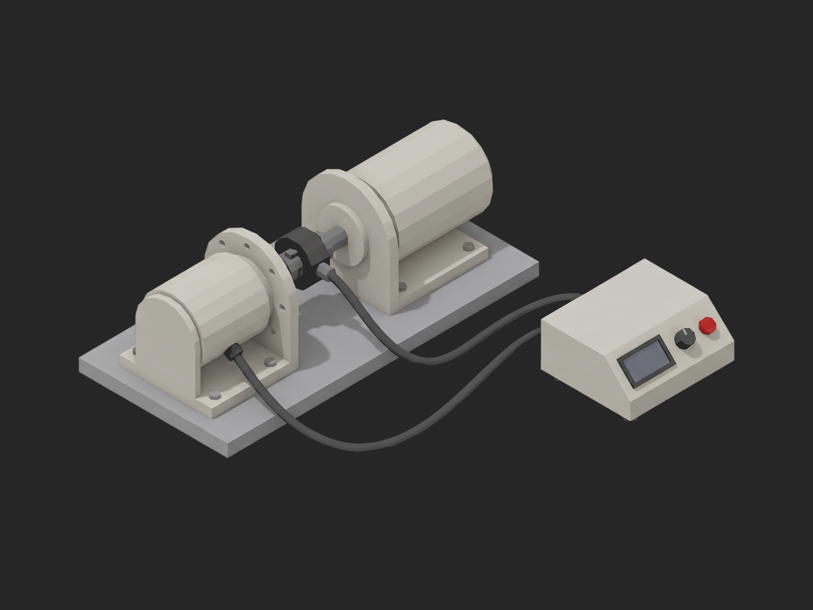

# Framework Actuator End-of-Line Dyno Test



A TofuPilot Framework procedure for the end-of-line dynamometer test of a humanoid joint actuator (frameless motor, 100:1 harmonic reducer, absolute output encoder, EtherCAT drive): drive identity and configuration read before the dyno moves, a time-scaled run-in at 2000 rpm input with the no-load running torque logged and its settled value limited, the output-referred torque constant from a locked-rotor current sweep with the friction knee and the linearity, a sixteen-point efficiency map from shaft power over bus power, and the torque ripple over one output revolution with the dominant order tracked to the wave generator. The mock bench synthesizes a healthy actuator on datasheet values.

## What This Shows

| Feature | Where |
|---------|-------|
| Progress component on a long phase, time-scaled mock | `run_in` -- `ui.run_in_progress`, `timeout: 30m` |
| Multi-dimensional measurements with derived aggregations | `no_load` (`final_nm`, `settle_pct`), `stall` (`kt_nm_per_a`, `linearity_pct`, `friction_knee_nm`), `ripple` (`pp_pct_rated`, `dominant_order`) |
| Three curves in one measurement, limits on one | `efficiency` -- `speed`, `torque`, `efficiency` (`at_rated_pct`, `min_pct`) |
| Integer aggregation validated `==` (an FFT order) | `ripple.dominant_order == 200` |
| String `matches` and JSON `==` on the drive before power | `firmware_version`, `drive_config` |
| Setup gate, teardown that parks and reads temperature, `depends_on` chain | `procedure.yaml` |

## Get Started

1. Sign up for a free TofuPilot account at [tofupilot.app](https://www.tofupilot.app/auth/signup).
2. Open the **New Procedure** flow in the dashboard and clone this template.
3. Follow the dashboard's instructions to set up a station and run the procedure.

For deeper guides, see the [TofuPilot docs](https://www.tofupilot.com/docs/framework) and the [Actuator End-of-Line Dyno Test template page](https://www.tofupilot.com/templates/actuator-end-of-line-dyno-test).

## Structure

```
.
├── procedure.yaml                    # Procedure, plug, phases, measurements
├── phases/
│   ├── identify.py                   # Setup: firmware, drive config, temperature
│   ├── run_in.py                     # 10 min run-in, no-load torque curve, progress
│   ├── torque_constant.py            # Locked-rotor current sweep, Kt, knee, linearity
│   ├── efficiency_map.py             # 4 speeds x 4 torques, shaft over bus power
│   ├── torque_ripple.py              # One revolution at 3 rpm, p-p and dominant order
│   └── park.py                       # Teardown: unload, disable, temperature
├── plugs/
│   └── actuator_bench.py             # Mock dyno + transducer + power analyzer + drive
├── utils/
│   └── recipe.py                     # Datasheet values, sweep points, run-in
├── pyproject.toml                    # uv-managed Python project
└── README.md
```

## Replace the Mock with Real Hardware

`plugs/actuator_bench.py` maps to a Magtrol WB eddy-current or a servo four-quadrant load, a Kistler 4503B or HBM T40B torque transducer with its angle output, a Yokogawa WT-class power analyzer on the bus, and the actuator's EtherCAT drive (Elmo, Kollmorgen, Synapticon) through pysoem or a real-time target. Set `TIME_SCALE = 1.0` in `utils/recipe.py` for the real run-in and raise the phase timeout to match. The phases, measurements and limits stay the same.
